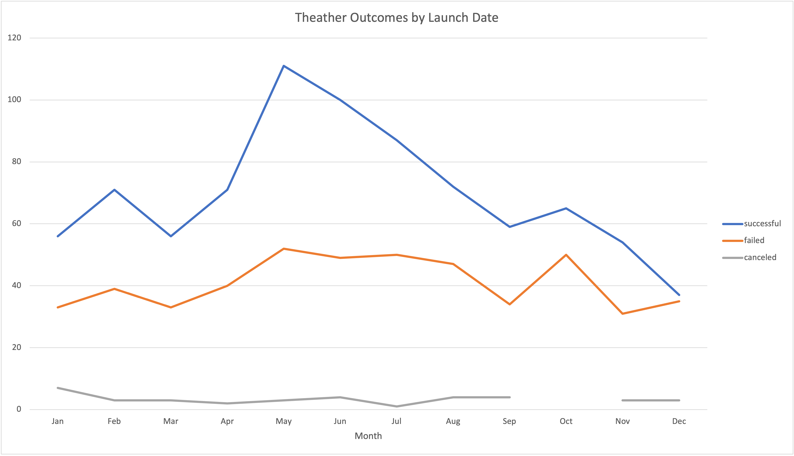
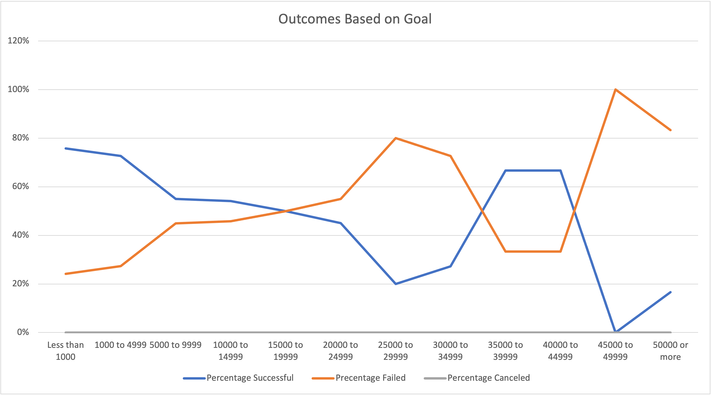

# Kickstarting with Excel

## Overview of Project

The purpose of this project was to determine the result of theater campaigns in the play category, based on their launch dates and goals. Louise has raised about $10,000 of her fundraising goal for her play, Fever, and this analysis will help her figure out when best to launch her campaign.

## Analysis and Challenges

### Analysis of Outcomes Based on Launch Date
The analysis for launch date outcomes was performed by examining the launch dates of plays, and their results from the “outcomes” column. Specifically, “successful”, “failed” and “canceled” were the ones examined. I created a pivot table from this data, filtered to the “theater” parent category, and compiled everything by month. After this table was done, I created a chart to accompany the data and present it visually.
	
### Analysis of Outcomes Based on Goals
For the “Outcomes Based on Goals” data, I used the “=countifs()” formula to group the data into the necessary range categories. After compiling all of the data with that formula and organizing the data with percentages of successful, failed and canceled plays, I created a line chart to show the trajectory of the data and how the three categories compared against one another.

### Challenges and Difficulties Encountered
Challenges I ran into included figuring out how to group the rows for the "outcomes based on launch date" and how to figure out the =countifs() formula. For both issues, I googled my problems, and used the links that were given in the challenge section of the module itself. The launch dates were originally in the mm/dd/yy format, which made the data look very messy, and right-clicking on one of the data points in that column let me group the list by months. As far as the =countifs() formula, I just needed a way to see what was needed in that formula, and the way to format it, and Googling helped me with that.

## Results 

- What are two conclusions you can draw about the Outcomes based on Launch Date?

The results were interesting – as far as the outcomes by launch date, those the highest number of successful plays was launched in May, followed by June. However, May was also the month with the highest number of failed plays – most likely because May has the highest number of started campaigns overall. However, there are many more successful plays than failed ones in May, proportionately. 
December, on the other hand, not only had the lowest number of successful plays, but also had about a 50/50 situation going on as far as successful vs failed plays, pointing to the fact that December is the worst month to launch plays overall. 
The graph below shows both of these conclusions - with May being the month with the largest space between successful and failed plays, with a huge peak compared to all other months, and December dipping down to not only the lowest month with successes, but the smallest difference, proportionately, when comparing successful and failed campaigns.

- What can you conclude about the Outcomes based on Goals?

As far as outcomes based on goals, the cheaper ranges tended to perform the best – with the $15,000 to $19,999 range putting the failed campaigns as the higher percentage compared with successful/canceled campaigns. However, the two data sets that fall in the range of $35,000 to $44,999 were more successful than not, but the number of campaigns for both data sets is very small, so this is not statistically significant when compared with the campaigns with smaller goals. The conclusion here, is that more than half of successful campaigns fell in the goal ranges of $0-$19,999, with the highest successful number proportionately being in the “below $1,000” range, and the highest total number of successful campaigns being in the $1,000 to $4,999 range. 

Here is the chart outlining this data:

As far as Louise’s play, Fever, her goal was $10,000, and 54% of the campaigns in that range were successful. What would likely help Louise with making her play more likely to succeed, would be to launch it in May. 

- What are some limitations of this dataset?

Some sections of the data set did not have any data at all. For example, none of these ranges encompassed any of the “canceled” campaigns, which would have been helpful in making Louise’s decision. Although no plays were cancelled at all, that data was not very useful to include in this analysis. If we had more data in general, I predict there could have been some cancelled ones - but without any data at all, we can't make data-backed decisions. 

There was also not much data in some of the sections, specifically campaigns starting at the $25,000 level had a significantly smaller number of results compared with data that was in the ranges below $25,000. Looking at this from a statistical significant standpoint, it did not make much sense to compare the lower range campaigns which the higher range ones, because they did not have nearly the same amount of data.

-	What are some other possible tables and/or graphs that we could create?

I think an interesting table and graph we could create, would be the percentage of successful campaigns compared with failed/canceled ones for the “outcomes based on launch date” data. When looking at the results, I noticed that that would have been a helpful metric to use to see which month performed best in comparison to failed and canceled campaigns, rather than just the greatest number of successful campaigns. My analysis ended up including this thought, although I did not have the percentages readily available. The same graph as the one made for "Outcomes vs Goals" would have been interesting to look at, as far as theater category launch dates by month, and the percentage that were successful, failed, or canceled. 

